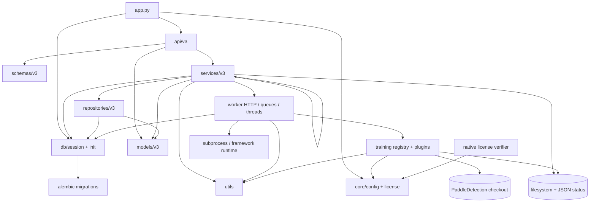
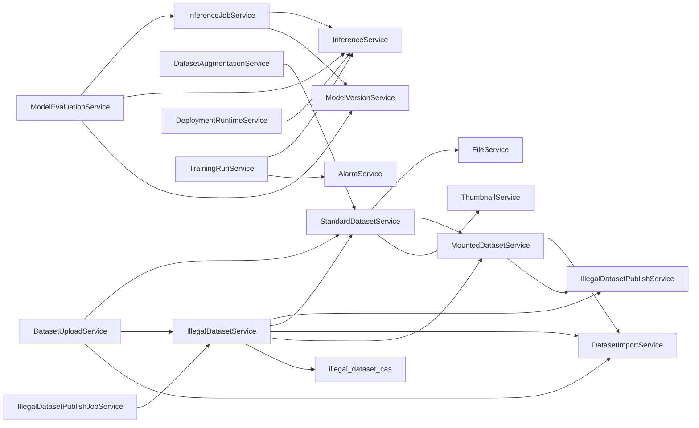

# TBS repository static audit (2026-09-02)

## Scope and method

This report treats the checked-in source code at commit `3c53c1d344c679ede76310fe226e71ebd16e5276` as the source of truth. Existing `docs/ai-kb/` content was deliberately not read or used. The audit covered all 229 tracked files (197 Python files), with separate treatment for first-party code, generated/lock files, migrations, tests, native code, runtime artifacts, and the untracked vendored `PaddleDetection` checkout.

Static evidence came from Python AST parsing, import/call-site analysis, line and byte counts, regex-based boundary/error/compatibility scans, exact normalized-function matching, test import mapping, pytest collection, and Git history for the preceding 12 months. Counts are signals, not substitutes for runtime profiling or coverage instrumentation.

## Executive assessment

The repository has a recognizable layered shape, but the effective architecture is service-centric rather than layered: `services/v3` contains 28 files and about 15,299 lines, owns DB transactions, filesystem mutation, task dispatch, status persistence, and cross-service orchestration. Several services have become application subsystems rather than services. The most urgent risks are:

1. Dataset responsibilities are fragmented across `illegal_dataset_service`, `illegal_dataset_publish_service`, `illegal_dataset_publish_job_service`, `illegal_dataset_cas`, `mounted_dataset_service`, `dataset_common`, `dataset_upload_service`, `standard_dataset_service`, and `file_service`. Their responsibilities are mutually entangled and ownership is non-local: storage, versioning, publication, import, and materialization do not each have a single explicit owner. This is a responsibility/ownership finding; the static call graph below does not establish a concrete strongly connected call component.
2. Background jobs do not share one state model. Training and deployment use DB enums; upload and publish jobs use DB string states; inference/evaluation/augmentation/conversion jobs use JSON files and process-local locks/threads. Recovery, cancellation, idempotency, and observability therefore differ by task type.
3. Training plugins and worker implementations mix configuration translation, subprocess lifecycle, metrics parsing, status repair, filesystem layout, and framework-specific execution. The largest function is Paddle `run()` at 585 lines.
4. Exception handling is dominated by broad `except Exception`: 38 sites in `paddle_det.py`, 30 in `inference_worker_impl.py`, and 23 in `training_run_service.py`. Many are legitimate process-boundary guards, but the density obscures failure contracts and makes partial failure hard to reason about.
5. Test discovery is not isolated. Bare `pytest --collect-only` enters `PaddleDetection` and exits on a missing custom operator. Scoped collection (`pytest tests --collect-only`) finds 65 tests but still fails because `test_model_evaluations.py` imports a private symbol no longer re-exported by `workers/inference_worker.py`.

## Module dependency graph



The intended downward flow is broken in a few important places: workers call `AlarmService`; utilities such as `mlflow_utils` open DB sessions; API route modules occasionally query models/DB directly; services construct and call other services; and filesystem-backed jobs behave as an alternate persistence layer beside the database.

## Largest 20 tracked files

Ranked by physical lines, excluding the deliberately ignored knowledge base. Lock/generated files are retained in the ranking and labeled.

| # | Lines | Bytes | File | Assessment |
|---:|---:|---:|---|---|
| 1 | 2,335 | 241,022 | `uv.lock` | generated lockfile |
| 2 | 1,639 | 66,576 | `services/v3/illegal_dataset_publish_service.py` | split |
| 3 | 1,414 | 56,613 | `services/v3/training_run_service.py` | split |
| 4 | 1,379 | 55,213 | `training/plugins/paddle_det.py` | split |
| 5 | 1,355 | 60,498 | `services/v3/illegal_dataset_service.py` | split |
| 6 | 904 | 37,855 | `services/v3/file_service.py` | split/refactor |
| 7 | 887 | 37,275 | `services/v3/standard_dataset_service.py` | split |
| 8 | 855 | 34,903 | `api/v3/training_runs.py` | split |
| 9 | 766 | 26,424 | `workers/inference_worker_impl.py` | split |
| 10 | 762 | 26,600 | `services/v3/dataset_common.py` | split |
| 11 | 729 | 18,882 | `native/license_verifier/Cargo.lock` | generated lockfile |
| 12 | 702 | 30,195 | `services/v3/illegal_dataset_publish_job_service.py` | refactor |
| 13 | 698 | 26,172 | `services/v3/illegal_dataset_cas.py` | refactor |
| 14 | 696 | 29,182 | `services/v3/model_evaluation_service.py` | refactor |
| 15 | 687 | 27,850 | `services/v3/mounted_dataset_service.py` | refactor |
| 16 | 662 | 27,394 | `tests/test_illegal_dataset_mounted_publish.py` | split by behavior |
| 17 | 657 | 28,783 | `services/v3/dataset_upload_service.py` | split/refactor |
| 18 | 655 | 26,345 | `services/v3/deployment_runtime_service.py` | split |
| 19 | 578 | 23,352 | `services/v3/inference_job_service.py` | refactor |
| 20 | 555 | 23,515 | `training/plugins/ultralytics_yolo.py` | split |

## Largest 20 functions/classes

AST span includes decorators and nested definitions only when they lie inside the symbol's source range. Classes are listed because their size exposes responsibility accumulation even when individual methods are moderate.

| # | Lines | Kind | Symbol |
|---:|---:|---|---|
| 1 | 1,289 | class | `IllegalDatasetService` |
| 2 | 1,229 | class | `TrainingRunService` |
| 3 | 880 | class | `FileService` |
| 4 | 831 | class | `StandardDatasetService` |
| 5 | 821 | class | `IllegalDatasetPublishService` |
| 6 | 669 | class | `IllegalDatasetPublishJobService` |
| 7 | 623 | class | `DatasetUploadService` |
| 8 | 622 | class | `PaddleDetTrainer` |
| 9 | 591 | class | `ModelEvaluationService` |
| 10 | 591 | class | `DeploymentRuntimeService` |
| 11 | 585 | function | `PaddleDetTrainer.run` |
| 12 | 494 | class | `InferenceJobService` |
| 13 | 451 | class | `AlarmService` |
| 14 | 439 | class | `InferenceService` |
| 15 | 357 | class | `ThumbnailService` |
| 16 | 353 | class | `DatasetImportService` |
| 17 | 351 | class | `UltralyticsYOLOTrainer` |
| 18 | 344 | class | `SystemMetricsService` |
| 19 | 342 | class | `DeploymentService` |
| 20 | 319 | function | `UltralyticsYOLOTrainer.run` |

Notable large standalone functions just below the top 20: initial migration `upgrade` (303), training metrics SSE (212), dataset `convert_dataset` (203), evaluation `_run_job` (197), mounted manifest construction (193), training `create_run` (167), training process `main` (153), and video inference `_run_video_job` (153).

## Service to Service calls

The following graph records direct construction/static calls found in service ASTs; shared helper modules inside `services/v3` are included because they are part of the coupling.



Highest fan-out orchestration points are `IllegalDatasetService`, `StandardDatasetService`, `DatasetUploadService`, and `ModelEvaluationService`. `dataset_common`, `illegal_dataset_cas`, and `mounted_dataset_service` are nominally helpers/services but collectively form an implicit dataset storage layer without one explicit owner.

## DB / filesystem / subprocess / worker boundaries

| Boundary | Current owners | Finding |
|---|---|---|
| Database sessions/transactions | API dependencies, repositories, most services, worker implementations, `mlflow_utils` | Transaction ownership is not uniform. Services often combine queries, commits, files, and remote dispatch, so DB rollback cannot roll back external effects. |
| ORM access | repositories plus direct service/API/worker queries | Repository abstraction is partial; it does not define the persistence boundary. `training_run_service` alone has roughly 137 DB-operation signals. |
| Dataset filesystem | `file_service`, `dataset_common`, `mounted_dataset_service`, `illegal_dataset_cas`, dataset services | Multiple modules validate paths, extract/copy/link trees, build manifests, cache statistics, and delete files. Atomicity and path-safety rules are distributed. |
| Job filesystem | inference/evaluation/augmentation/conversion services/workers | JSON status/result files are a second database. Locks are process-local, so multi-process coordination and crash recovery depend on filesystem conventions. |
| Subprocess | `worker_impl` (12 signals), worker entrypoints, Paddle plugin, conversion task, system metrics | Training subprocess supervision is centralized mostly in `DbQueueWorker`, but framework plugins and conversion code still own portions of process/error lifecycle. |
| Worker dispatch | training DB polling; worker HTTP for inference; local background threads for jobs; conversion queue | Four execution models have four cancellation/retry/recovery contracts. |
| Framework runtime | `training/plugins/*`, inference worker implementations, external `PaddleDetection` | Framework adapter boundary exists, but plugin `run()` methods still absorb orchestration and metrics responsibilities. |
| Native license | `core/license.py`, compiled Rust extension, protected-runtime build script | Clear security boundary, but packaging/build compatibility wrappers add operational complexity. |

The critical consistency gap is “DB commit followed by filesystem/worker action” without durable workflow ownership. The required model is a durable job with an explicit state machine, lease ownership, idempotent execution, retry policy, and reconciliation or compensation for partial external effects. If dispatch is later performed through a message broker, a transactional outbox can make the DB-state/message-publication boundary reliable; an outbox alone cannot make large filesystem conversions, renames, subprocesses, Docker calls, or HTTP worker effects atomic. Failures can currently leave DB state, JSON state, and actual process state disagreeing.

## Background task state machines

### Training run (DB-backed)

```text
CREATED -> QUEUED -> RUNNING -> COMPLETED
                  |       |-> FAILED -> QUEUED (resume)
                  |       |-> CANCELLED -> QUEUED (resume)
                  |       `-> DELETED
                  `-> CANCELLED -> DELETED
```

Worker heartbeat loss can mark a run `FAILED`; both `training_run_service` and the training subprocess contain repair logic that changes false `FAILED` back to `RUNNING` or infers `COMPLETED` from artifacts. This is compatibility/recovery logic around a split-brain supervisor and is a high-priority redesign target.

### Deployment run (DB-backed, stepful)

```text
QUEUED -> RUNNING -> COMPLETED
   |         |----> FAILED
   |         `----> CANCELLED
   `--------------> CANCELLED
```

Phases/steps are `validate_artifacts -> materialize_runtime -> smoke_test -> activate`; deployment status moves `PENDING -> DEPLOYING -> ACTIVE`, with `FAILED`, `INACTIVE`, and rollback-like reset to `PENDING`. This is the most explicit state machine, but it lives inside a 591-line service class rather than a transition model.

### Dataset upload/import (mixed DB strings + local thread)

Upload session: `uploading -> completing -> completed`, with `failed`, `cancelled`, and cleanup to `expired`. Import task: `queued -> extracting -> linking/validating -> done`, or `failed`. Status and stage vocabularies overlap but are not typed and terminal names differ (`completed` versus `done`).

### Illegal dataset publish (DB strings + local executor)

`queued -> running -> completed | failed | cancelled`; idempotency and cancellation are persisted, but execution is launched in-process. A restart can retain durable state without a durable executor lease.

### Inference and model evaluation (JSON + HTTP worker/thread)

Both implement nearly identical status-file, lock, cursor, update, and results-since logic. Typical states are `queued/running/completed/failed/cancelled`, but the authoritative state is a JSON file. Exact duplicates (`_read_json`, `_job_lock`, `_update_status`, `read_results_since`) confirm a missing shared job abstraction.

### Augmentation and model conversion

Augmentation uses filesystem status plus a background job. Conversion uses worker queues/tasks and filesystem job metadata. Neither participates in a repository-wide task registry. The historical revision name `0012_unified_task_system` suggests that a unified-task concept once existed, but this checkout contains only a no-op placeholder and explicitly says the original migration source is absent. Its tables, runtime semantics, deployment history, and reason for removal therefore cannot be established from this repository.

## Duplicate code hotspots

High-confidence normalized AST matches:

| Duplicate | Locations | Recommendation |
|---|---|---|
| YOLO box parsing | `dataset_common._parse_yolo_boxes`, `illegal_dataset_cas._parse_manifest_yolo_boxes` | one parser with input adapter |
| job status primitives | inference job and model evaluation services | extract a durable job store/protocol, not just helpers |
| dataset list/import/upload routes | illegal and standard dataset API modules | shared application commands/query mapping while retaining separate domain validation |
| dataset list services | illegal and standard dataset services | common pagination/query specification |
| mounted file entry building | `illegal_dataset_cas`, `mounted_dataset_service` | one manifest value object/builder |
| trainer boolean coercion | Paddle and Ultralytics plugins | common config coercion in plugin base |
| training option normalization | augmentations and loss weights | generic validated option schema only if semantics truly align |
| publish label tree helpers | duplicated twice inside `illegal_dataset_publish_service.py` itself | immediate deduplication |
| worker `main`/runner wrappers | inference and Paddle inference implementations | common entrypoint harness |
| cursor parsing | deployment runs and inference jobs API | API utility or schema type |
| seed architecture variants | five nearly identical functions in `db/seed_data.py` | declarative data table |

The dataset API similarities are expected domain symmetry; extracting endpoint wrappers alone would create indirection. The valuable reuse point is below HTTP, around query specifications, upload commands, and manifest/path primitives.

## try/except hotspots

| File | `try` | Broad catches | Interpretation |
|---|---:|---:|---|
| `training/plugins/paddle_det.py` | 39 | 38 | framework/version probing and best-effort metrics dominate control flow |
| `workers/inference_worker_impl.py` | 30 | 30 | optional imports, media/model execution, worker API boundary |
| `services/v3/training_run_service.py` | 26 | 23 | recovery, filesystem/MLflow probing, orchestration |
| `services/v3/illegal_dataset_cas.py` | 23 | 20 | storage parsing and cleanup |
| `services/v3/dataset_common.py` | 21 | 20 | permissive dataset/file parsing |
| `services/v3/file_service.py` | 20 | 20 | archive/file compatibility and cleanup |
| `services/v3/illegal_dataset_service.py` | 19 | 13 | DB/filesystem multi-step operations |
| `api/v3/training_runs.py` | 18 | 17 | multiple fallback sources in route layer |
| `services/v3/illegal_dataset_publish_service.py` | 18 | 10+ | conversion pipeline partial failures |
| `utils/mlflow_utils.py` | 17 | 16 | best-effort external telemetry |

Recommended rule: broad catches remain only at process, request, thread, optional-dependency, and cleanup boundaries; internal transformations should raise typed domain errors. Best-effort branches must record structured context and must not silently choose a different source of truth.

## Compatibility logic hotspots

1. `file_service.py`: archive decoding/layout/category compatibility; ten lexical signals and many broad catches.
2. `paddle_det.py`: old Paddle/protobuf fallback, config shape probing, scalar metric fallback.
3. `ultralytics_yolo.py`: model-weight fallback search and version-dependent configuration.
4. `training_run_service.py` plus `workers/training/train_entry_impl.py`: repair of false heartbeat-loss failures and legacy comparison behavior.
5. `path_utils.py`: accepts existing absolute paths for backwards compatibility, weakening a single storage-token invariant.
6. `api/v3/training_runs.py`: DB/MLflow and artifact-location fallbacks live in the HTTP layer.
7. Worker `*_impl.py` plus 9-line public wrappers: protected-runtime/packaging compatibility seam. Keep the seam while it is a build contract, but make exports explicit; wildcard export already caused a test collection failure for a private helper.

Compatibility code should be tied to a named supported version or persisted data generation. Untargeted “fallback to anything that exists” behavior should be removed after migration because it hides corrupt or ambiguous state.

## TODO / workaround inventory

There are no literal `TODO`, `FIXME`, or `HACK` markers in tracked first-party Python. Two Chinese “兼容” messages in `file_service.py` are user-facing validation, not work items. The actual workaround debt is encoded as comments/behavior rather than markers:

- Paddle/protobuf compatibility fallback.
- absolute-path backwards compatibility.
- MLflow-to-DB and artifact search fallbacks.
- heartbeat-loss status healing in two modules.
- best-effort exception swallowing throughout metrics, storage, and cleanup paths.
- public wrapper wildcard imports used to separate protected implementation modules.

This absence of TODOs should not be read as absence of debt; it means debt has no expiry metadata or owner.

## Test coverage map

This is a static reachability map, not statement coverage.

| Area | Direct test evidence | Gap |
|---|---|---|
| illegal dataset publish/mount/CAS | strongest: 26+ focused cases across two large files | service remains much larger than tested paths; concurrency/crash recovery largely untested |
| standard dataset listing | 2 focused tests plus publish integration-style mocks | file mutations, upload, delete, cache invalidation weakly covered |
| upload progress | 1 focused test | upload session lifecycle and extraction safety not mapped |
| training params/schedulers | strong small-unit coverage | full training orchestration, cancellation, heartbeat repair absent |
| project training alerts | 2 focused tests | broader alarm rules and resolution lifecycle absent |
| model evaluation | intended tests exist | collection currently broken by private re-export change |
| license | 10 focused tests | native verifier/build integration not covered here |
| PaddleDetection path resolution | 3 tests | actual Paddle execution external/environmental |
| API v3 (26 route modules) | no direct route/TestClient tests | routing, dependency, serialization, error mapping unverified |
| repositories (12 modules) | no direct tests | query semantics only incidentally exercised with mocks |
| deployment/inference/runtime | no effective direct coverage | highest operational risk after dataset/training |
| migrations (21 revisions) | no migration-up/down smoke check | schema drift risk |

Collection facts:

- `pytest --collect-only -q`: enters vendored `PaddleDetection`, collects upstream tests, then aborts on missing `deformable_detr_ops`.
- `pytest tests --collect-only -q`: discovers 65 first-party tests, then reports one collection error because `_extract_ultralytics_val_metrics` is defined in `inference_worker_impl.py` but omitted by wildcard import from the public wrapper (leading underscore).
- No coverage configuration or coverage artifact was found among tracked files, so percentages cannot be stated honestly.

## Recent commit hotspots

Current tracked files touched during the last 12 months, ranked primarily by commits touching the file. Churn is added plus deleted lines and includes rewrites.

| File | Touches | Churn | Meaning |
|---|---:|---:|---|
| `services/v3/illegal_dataset_service.py` | 23 | 4,934 | highest active domain volatility |
| `core/config.py` | 16 | 476 | configuration remains a cross-cutting hotspot |
| `pyproject.toml` | 15 | 225 | packaging/tooling volatility |
| `workers/inference_worker.py` | 14 | 2,278 | now a 9-line wrapper; large churn indicates recent implementation split |
| `services/v3/standard_dataset_service.py` | 13 | 2,606 | dataset domain volatility |
| `api/v3/illegal_datasets.py` | 13 | 1,251 | API/domain churn coupled |
| `training/plugins/ultralytics_yolo.py` | 12 | 818 | framework compatibility hotspot |
| `app.py` | 12 | 388 | composition/startup changing often |
| `services/v3/illegal_dataset_publish_service.py` | 11 | 4,504 | very high churn and size |
| `workers/training/train_entry.py` | 11 | 1,400 | now wrapper after implementation split |
| `db/seed_data.py` | 11 | 648 | architecture catalog churn |
| `workers/worker.py` | 10 | 1,854 | wrapper split/churn |
| `services/v3/dataset_upload_service.py` | 9 | 1,856 | lifecycle changes |
| `schemas/v3/illegal_datasets.py` | 9 | 830 | contract churn |
| `training/plugins/paddle_det.py` | 8 | 4,076 | largest churn per touch among runtime modules |
| `services/v3/dataset_common.py` | 8 | 1,865 | shared-helper accretion |
| `services/v3/inference_service.py` | 8 | 1,611 | inference orchestration volatility |

`README.md`, `CHANGELOG.md`, and `uv.lock` have higher raw touch/churn counts but are excluded from architectural prioritization. Historical hotspot names that are no longer tracked show that a v2-to-v3 rewrite already occurred; current v3 fallback and `0001_initial_v2_schema` naming are historical residue, not evidence that v2 runtime modules still exist.

## Module disposition

Labels describe the recommended next architectural action, not an instruction to delete immediately.

### KEEP

| Module(s) | Reason |
|---|---|
| `train_platform/app.py`, `api/deps.py`, `api/v3/__init__.py` | valid composition/root routing roles; keep thin |
| most `api/v3/*` route modules except `training_runs.py` | domain-aligned endpoints and generally modest size |
| `schemas/v3/*` | coherent transport-contract layer; keep domain grouping |
| `models/v3/*` | coherent ORM domain grouping; preserve typed enums and relationships |
| `repositories/v3/base.py` and simple repositories | useful query boundary where actually used |
| `core/config.py`, `core/license.py` | legitimate cross-cutting configuration/security ownership; reduce callers' fallback logic instead |
| `db/session.py`, `db/base.py` | clear infrastructure roles |
| `services/v3/architecture_service.py`, `framework_service.py`, `qualified_model_service.py`, `model_version_service.py`, `model_evaluation_metrics.py`, `deployment_adapters.py` | focused modules with bounded responsibilities |
| `training/plugins/base.py`, `training/registry.py` | correct plugin boundary |
| `utils/exceptions.py`, `image_exts.py`, `paddledet_paths.py`, `zip_encoding.py` | focused primitives |
| `native/license_verifier` | isolated native security boundary |
| Dockerfiles and requirement sets | environment boundaries are explicit, though duplication should be monitored |

### REFACTOR

| Module(s) | Required direction |
|---|---|
| `illegal_dataset_cas.py`, `mounted_dataset_service.py`, `dataset_common.py` | establish one dataset storage/manifest boundary; centralize path, manifest, parse, atomic-write semantics |
| `dataset_upload_service.py`, `illegal_dataset_publish_job_service.py` | move execution onto a durable common task lease/executor; type states and transitions |
| `inference_job_service.py`, `model_evaluation_service.py`, `dataset_augmentation_service.py`, model conversion modules | replace duplicated JSON/lock/thread job stores with one durable job protocol |
| `alarm_service.py` | separate rule evaluation from alert persistence/lifecycle |
| `inference_service.py` | separate model/runtime resolution from transport/execution |
| `project_service.py`, `deployment_service.py` | remove direct orchestration/query accumulation and clarify transaction owner |
| `repositories/v3/*` as a package | either consistently own persistence queries or remove pass-through repositories; current partial adoption adds two access styles |
| `utils/mlflow_utils.py` | isolate external telemetry adapter and make best-effort semantics explicit |
| `utils/path_utils.py` | converge on storage tokens; migrate then remove absolute-path compatibility |
| `db/init_db.py`, `db/seed_data.py` | keep startup verification separate from mutable seed/catalog reconciliation |
| test configuration | constrain discovery to `tests/`, repair public/private import contract, then add coverage reporting |

### SPLIT

| Module | Suggested responsibility split |
|---|---|
| `illegal_dataset_service.py` | dataset commands, version/manifest operations, label mapping, publish orchestration, query/read model |
| `illegal_dataset_publish_service.py` | annotation parsers, mapping/tree policy, conversion pipeline, output writer |
| `standard_dataset_service.py` | queries, import/materialization, statistics/view cache, file mutations |
| `file_service.py` | upload/archive extraction, dataset validation, mutation operations; shared safe archive primitive |
| `training_run_service.py` | lifecycle/state transitions, run creation/config, artifacts/metrics, comparisons/benchmarks |
| `api/v3/training_runs.py` | lifecycle endpoints, metrics/log streaming, artifacts/reports/options |
| `deployment_runtime_service.py` | transition model/lease, artifact materializer, smoke tester, activation coordinator |
| `training/plugins/paddle_det.py` | config adapter, execution adapter, metrics callbacks/parser, framework compatibility module |
| `training/plugins/ultralytics_yolo.py` | config/weights resolver, training executor, export/metrics adapter |
| `workers/inference_worker_impl.py` | HTTP/control surface, model cache/runtime, image/video inference, validation metric extraction |
| `workers/worker_impl.py` | DB lease/polling, subprocess supervisor, heartbeat/recovery |
| `workers/inference_job_task.py` | shared job IO, image path, video path |
| `utils/training_report_docx.py` | document model/content generation and OOXML packaging |
| `tests/test_illegal_dataset_mounted_publish.py` | manifest, conversion, mapping, mounted import, activation behavior files |

Splits should follow domain/lifecycle ownership. They should not be mechanical “one class per file” extractions or forwarding wrappers.

### DELETE

| Module/artifact | Evidence and condition |
|---|---|
| `training/plugins/stubs.py` | no current import or registry use; only defines `NotImplementedTrainer`; delete after one runtime import check |
| empty untracked directories `train_platform/api/v2`, `schemas/v2`, `tasks/runners` | not Git-tracked and contain no source; remove from working tree if confirmed not externally generated |
| tracked `.runtime/.node_state.dat` | runtime state should not be versioned; remove from Git and keep ignored after confirming no packaging dependency |

No other production module has enough static evidence for deletion. In particular, lack of direct tests is not deletion evidence.

### LEGACY

| Module(s) | Treatment |
|---|---|
| `db/migrations/versions/0001...0021` | immutable schema history; retain, do not refactor for style |
| worker public wrappers (`worker.py`, `*_worker.py`, `training/train_entry.py`) and corresponding `*_impl.py` split | packaging/protected-runtime compatibility seam; retain until build contract changes, replace wildcard exports with explicit public surface |
| `core/build_protected_runtime.py` | build-time legacy/compatibility infrastructure, intentionally removed from runtime distribution |
| absolute filesystem path support in `utils/path_utils.py` | migration-only compatibility; inventory persisted values and retire |
| heartbeat-loss repair logic in training service/entrypoint | operational compatibility around split supervision; retire after durable lease/state redesign |
| Paddle/protobuf and framework-version fallbacks | retain only for explicitly supported dependency matrix; add version bounds and removal criteria |
| `scripts/migrate_illegal_versions_to_cas.py` | one-time migration utility; archive/delete only after all deployed databases are certified migrated |

## Recommended sequence

1. Fix the test boundary first: configure discovery to `tests`, repair the inference worker export/import, and establish real coverage output. This makes later restructuring measurable.
2. Document only the minimum cross-task invariants: explicit states and allowed transitions, durable identity, lease/heartbeat ownership, idempotency key, retry policy, cancellation semantics, and reconciliation responsibility. Do not introduce a generic task table, base class, or `UnifiedTaskService` at this stage.
3. Validate those invariants in one closely related task family with demonstrated duplication—preferably inference plus model evaluation—while keeping domain-specific payloads, transitions, execution policy, and result models separate. Extract shared infrastructure only after the concrete implementation proves the seam.
4. Consolidate dataset storage and manifest primitives, then split the three oversized dataset services around commands, reads, conversion, and storage ownership.
5. Apply the proven durable-job primitives selectively to publish/upload/conversion. Use a transactional outbox only if broker dispatch is introduced; use idempotency plus reconciliation/compensation for filesystem and process side effects.
6. Replace training heartbeat repair with one durable supervisor/lease model; then split worker supervision from framework plugin execution. Training and deployment should retain their own domain state machines rather than being forced into a generic task model.
7. Split deployment runtime around its already-visible steps and move transition validation into an explicit state model.
8. Remove confirmed dead/working-tree residue and put expiry metadata on retained compatibility paths.

The first architectural change should not be a repository-wide “unified task framework.” The safe seam is a small set of durable-work invariants, proven first against one duplicated task family. Shared code should remain limited to infrastructure concerns such as leasing, durable event/progress persistence, and dispatch reliability; domain transitions, payloads, execution, compensation, and results should stay with each workflow. This avoids replacing several existing services with a new generic God Service.
